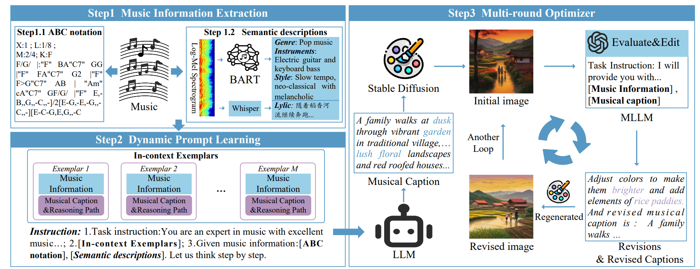
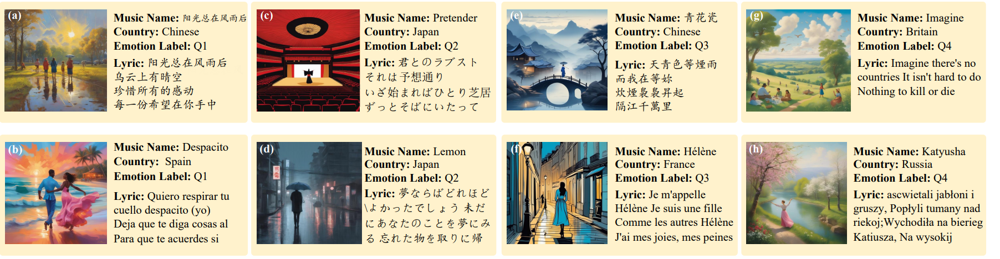

# Musical Chain-of-Thoughts for Image Synthesis

## **Overview**

Music-driven image synthesis, which aims to generate images aligned with the content and emotions of music, has garnered widespread attention today. However, current GAN-based methods produce blurry and tedious images, while the large-scale image synthesis models like Stable Diffusion, which can generate high-quality images, cannot process music inputs. In this work, we introduce a training-free method, namely Musical Chain-of-Thoughts (MCoT), which employs LLM as a musical image planner through its powerful chain-of-thought reasoning abilities, enhancing the large-scale image synthesis model in producing music-aligned images. Our method comprises three key components: 1) Music information extraction transforms original music into text by explicitly identifying music elements such as mode, tonality, genre, and instrument; 2) Dynamic prompt learning involves selecting the most helpful exemplars to construct prompts, enabling large language model (LLM) to produce musical captions that are then fed into Stable Diffusion to generate images; 3) Multi-round optimizer iteratively refines the musical caption to improve the generated image quality. We conduct extensive experiments on the popular dataset EMOPIA and the self-constructed dataset AnyMusic. The results demonstrate that our method can transfer a given music into a high-quality image aligning  with music content and emotions, based on the large-scale image synthesis model. The ablation studies highlight the effects of each component. 



## **Project Structure**

```Plain Text
project/
│
├── data/                     # Dataset folder
│   ├── raw/                  # Raw datasets
│   ├── processed/            # Processed datasets
│
├── models/                   # Model architectures and weights
│   ├── base_model.py         # Base model implementation
│   ├── custom_model.py       # Custom model architecture
│
├── scripts/                  # Training and evaluation scripts
│   ├── train.py              # Training script
│   ├── evaluate.py           # Model evaluation script
│
├── utils/                    # Utility functions
│   ├── data_loader.py        # Data loading functions
│   ├── visualization.py      # Visualization tools
│
├── requirements.txt          # Python dependencies
├── README.md                 # Project documentation
├── config.yaml               # Project configurations
└── main.py                   # Main entry point
```


## **Installation**

1. Clone the repository:

    ```Shell
    git clone https://github.com/your-username/deep-learning-project.git
    cd deep-learning-project
    ```

1. Install dependencies:

    ```Shell
    pip install -r requirements.txt
    ```

1. Configure project settings:
Modify the config.yaml file to configure the URL and API key for GPT-4.

---

## **Usage**

Place the music files in the data folder and run m2i.py.


## **Results**


## **Dataser**

Anymusic contains 10,000 well-known songs from around the world, curated through GPT recommendations and manual collection. It includes a variety of genres, emotions, and content. Currently, 20 sample entries are open-sourced for reference. The dataset can be accessed at xxbaidu.com. The full dataset will be released after the paper is published.

## **License**

This project is licensed under the MIT License. See the `LICENSE` file for details.

